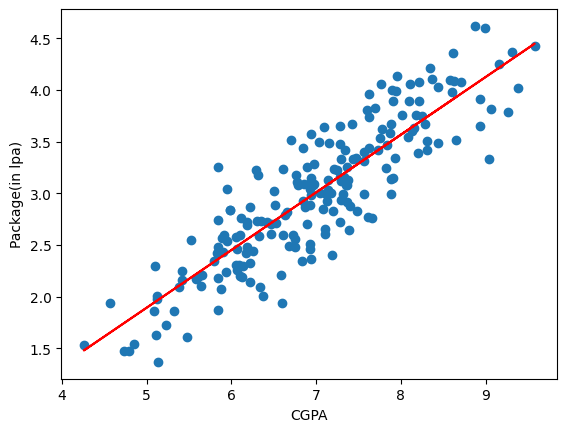

# CGPA Package Prediction using Linear Regression

This is my beginner Machine Learning project where I used Linear Regression to predict a student's placement package based on their CGPA.

## What I Used

* Python
* Pandas
* NumPy
* Matplotlib
* Scikit-learn

## Machine Learning Algorithm

**Linear Regression**

The model learns the relationship between:

* **Input:** CGPA
* **Target:** Placement Package (LPA)

## Project Workflow

1. Load the dataset using Pandas
2. Select CGPA and package columns
3. Split the data into training and testing sets
4. Train a Linear Regression model
5. Make predictions
6. Visualize the regression line

## Files

* `main.py` — Python code for the project
* `placement.csv` — Dataset used for training and testing

## What I Learned

Through this project, I practiced:

* Loading CSV data with Pandas
* Selecting data for machine learning
* Train-test splitting
* Training a Linear Regression model
* Making predictions with `predict()`
* Understanding the coefficient and intercept
* Visualizing a regression line

## Future Improvements

I plan to improve this project by:

* Adding model evaluation metrics
* Using more features
* Trying other Machine Learning algorithms
* Comparing different models
